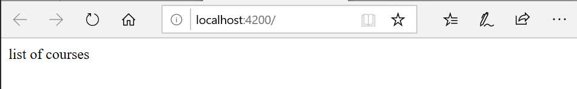
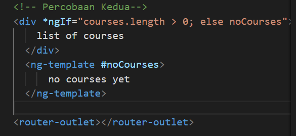
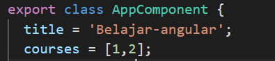
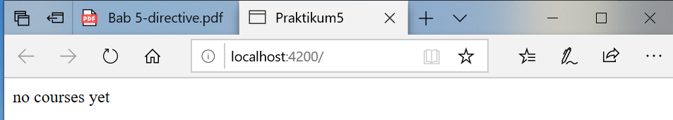
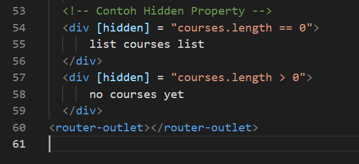
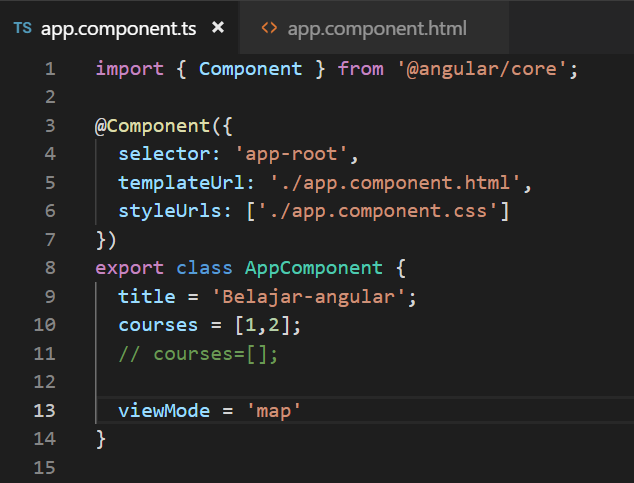
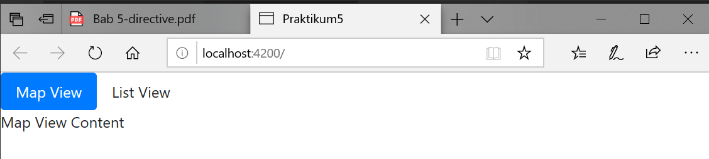
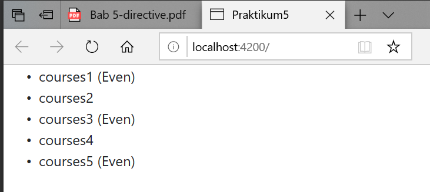

# Directive

**1. NgIF**
- Buka file

- Buka file

- Jalankan locallhost maka hasilnya seperti berikut :

- Jika array pada app.component.ts (courses=[];) dikosongkan maka hasilnya seperti berikut :
 
 
*contoh kedua  menggunakan else:*
- buka file app.component.html modifikasi kodenya menjadi berikut  
 

- jalankan localhost dengan kondisi array pada app.component 
* dengan array kosong

* dengan array ada isi

*Cara ketiga*

- Buka file app.component.html modifikasi kodenya menjadi berikut

- jalankan localhost dengan kondisi array pada app.component

* dengan array kosong

* dengan array ada isi

**Hidden Property**

- buka app.component.html 

- jalankan localhost maka hasilnya seperti berikut : 

- selain contoh diatas kita juga dapat memberikan property seperti berikut:

- jalankan localhost (berbeda hasil jika pada array courses tidak terdapat isinya)

- Jika kita inspect element maka akan terlihat property hidden tidak terdapat kondisi true ataupun false.

- berbeda jika kita menggunakan ngIF terdapat bindings dengan nilai false 

**ngSwitchCase**

- buka file app.component.html modifikasi codenya menjadi seperti berikut 

- buka file app.component.ts tambahkan property viewMode (line 12) 

-  run localhost maka hasilnya seperti berikut saat diklik list view maka akan muncul list view content dan jika kita pilih ListView maka akan tampil tulisan List View Content 
 
 
**NgFor**
- buka app.component.ts property CoursesFor yang berisikan array (line 12) 
 

 - - buka file app.component.html tambahkan directive ngFor pada element li
 

 - jika dijalankan maka hasilnya seperti berikut
  

  - kita juga dapat memberi tanda tertentu pada index yang bernilai ganjil dengan menggunakan isEven https://angular.io/api/common/NgForOf  
   
   

**6.1 ngFor dan change Detection**
- tambahkan button pada app.component.html (line 64) 
 

 - tambahkan method onAdd()
  

 - sehingga hasilnya seperti berikut (jika kita tekan button add maka akan ditambahkan sebuah data courses 6) 
    
    

- Tambahkan sebuah method onRemove pada app.component.ts 

- Buka app.component.html dan tambahkan sebuah button untuk menghapus (line69)

- hasilnya seperti berikut (pada saat button remove diclick maka salah satu data akan hilang sementara)

- buka file app.component.html tambahkan button (line 70) 

- buka file app.component.ts buatlah sebuah method onChange dengan parameter item dan didalam method tersebut adanya perubahan string menjadi updated 

- hasilnya 

**ngFor dan trackby**

- Buka file app.component.ts buatlah sebuah method dengan nama loadCourses (line 38) tapi sebelumnya buat sebuah property dengan nama coursesForOne (line 37) 

- buka file app.component.html dan tambahkan code seperti pada gambar

- hasilnya saat button diclick

- sekarang kita lakukan analisa buka inspect element, saat button belum diclick seperti pada gambar berikut 

- dan saat button diklik maka element ul akan muncul seperti pada gambar berikut :
 

- untuk menambahkan TrackBy dengan cara menambahkan pada app.component.html pada directive ngFor 

- selain itu tambahkan juga sebuah method trackCourse dengan parameter index dan itemone pada app.component.ts

**6.1 The leading Asterik**

**6.1 ngClass**

**6.1 Custom Directive**
- pertama kita harus membuat directive dengan nama input-format terlebih dahulu dengan perintah seperti berikut

- jika directive berhasil digenerate maka kita pastikan di app.module.ts pada @NgModule terdapat nama directive yang kita buat tadi 
 
 
 - buka input-format.directive.ts dan tambahkan decorator HostListener seperti pada gambar berikut
  

- Buka file app.component.html dan tambahakn code berikut
  

- buka file input-format.directive.ts dan modifikasi codenya menjadi berikut 
 

 - buka file app.component.html dan tambahkan property binding dengan nama format 
  

- buka file input-format.directive.ts tambahkan decorator input dan modifikasi codenya seperti pada gambar berikut
    

- cat:format disini adalah kondisi di app.component.html 
    

- buka app.component.hml modifikasi codenya menjadi berikut
 

 - buka input-format.directive.ts dan tambahkan decorator input dengan parameter appInputFormat 
  

  - HASIL
    
    
