#Jobsheet-10: Routes

**Praktikum – Bagian 1: Configure the routes**

1. Buat project baru yang berisi komponen posts (praktikum http service), form-member (soal uts), navbar, not-found, home
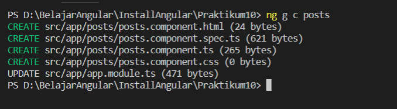
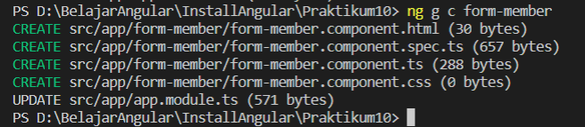
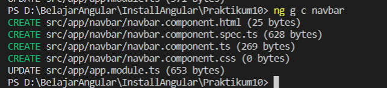
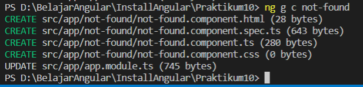
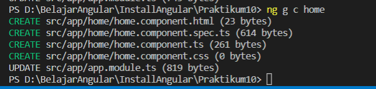

2. Jika node_modules belum tersida, install menggunakan npm install
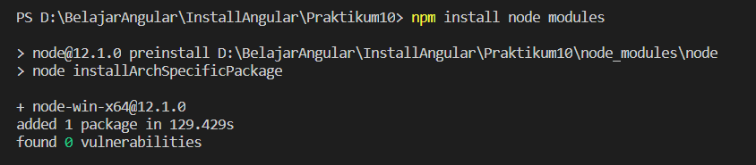

3. Buka file app.module.ts. Pastikan komponen pada langkah 1 sudah terdaftar seperti gambar dibawah ini

4. Tambahkan module router pada halaman app.module.ts seperti gambar dibawah ini:
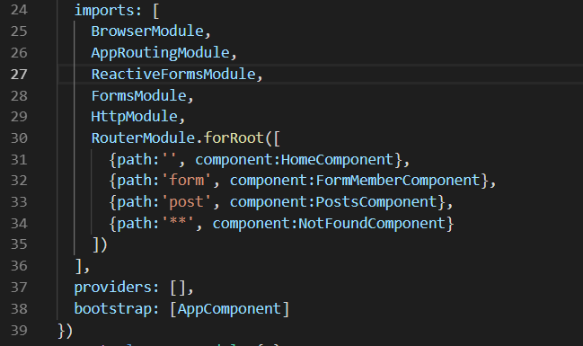

5. Buka halaman navbar.component.html dan tambahkan kode dibawah ini:
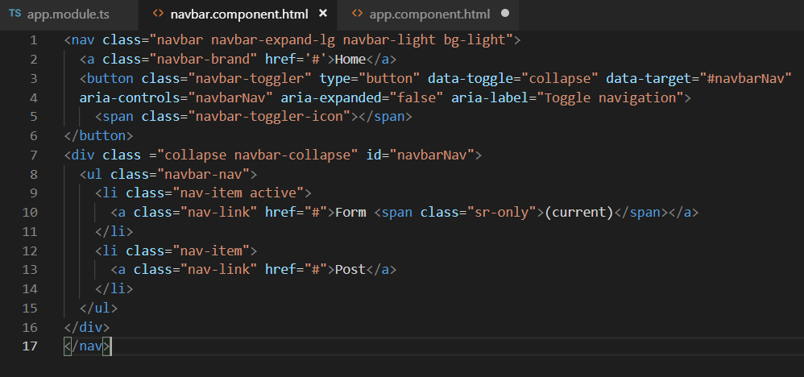

6. Buka halaman app.component.html. tambahkan kode dibawah ini:
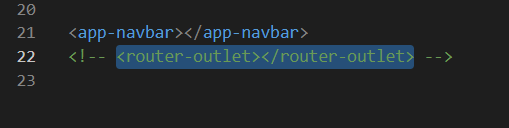

7. Jalankan dan catat hasilnya (soal no. 1)
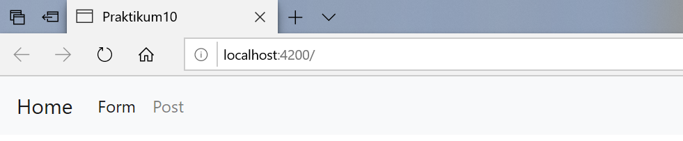

**Praktikum - Bagian 2 : Router Outlet**
1. Buka halaman app.component.html dan rubah menjadi seperti dibawah ini:
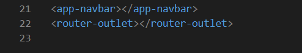

2. Jalankan dan inspect elemen seperti pada gambar dibawah ini:
Apa yang bisa anda simpulkan? (Soal No 2) 
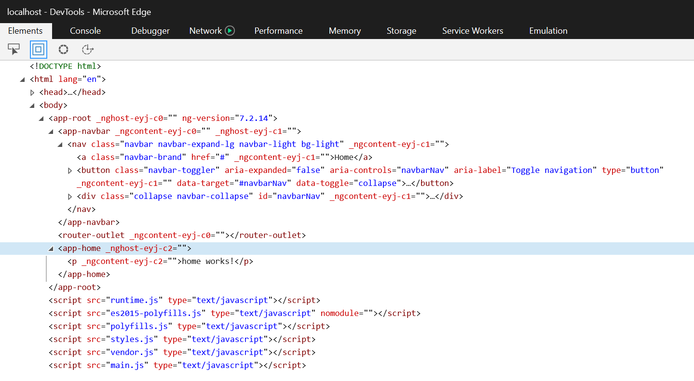

3. Jalankan link dibawah ini localhost:4200/form seperti gambar dibawah ini: catat hasilnya (Soaln No. 3)
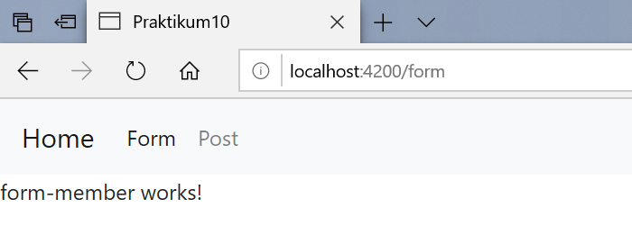

4. Jalankan link dibawah ini localhost:4200/post seperti gambar dibawah ini:catat hasilnya (Soaln No. 4)
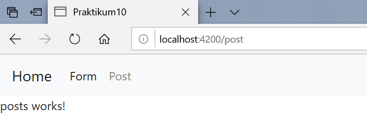

5. Jalankan link dibawah ini localhost:4200/coba seperti gambar dibawah ini: catat hasilnya (Soaln No. 5)

6. SImpulkan langkah 3, 4 dan 5 (Soal No. 6)
  output yang dikeluarkan akan berbeda sesuai dengan link yang kita ketik. hasil dari link form adalah form-member works, hasil link post adalah post works sedangkan yang link coba adalah not-found works karena pada sebelumnya kita belum membuat class coba.

**Praktikum - Bagian 3 : Add Link**
1. Buka halaman navbar.component.html. tambahkan link pada href tiap menu seperti gambar dibawah ini:
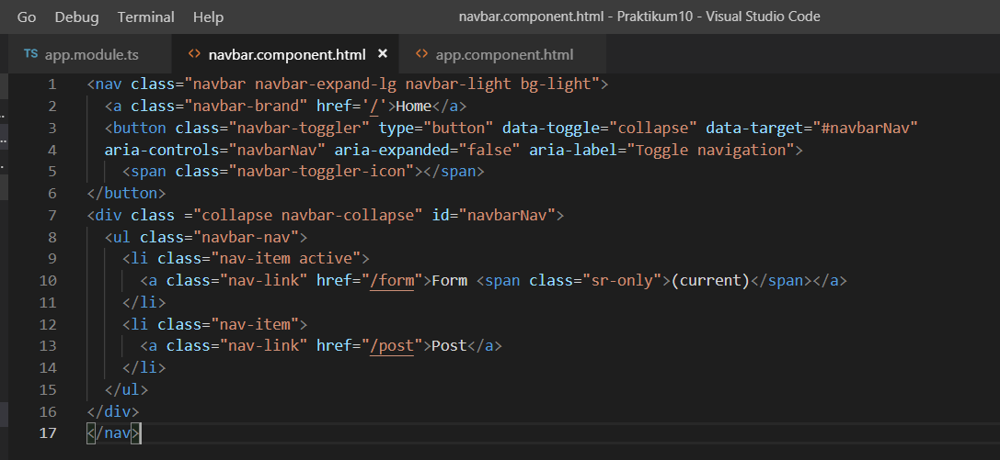

2. Jalankan, catat dan berikan penjelasan (Soal No. 7)
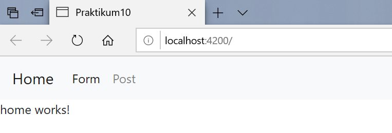
  hasil yang ditampilkan adalah Home works karena pada halaman navbar.component.html link href pada menu diisi dengan home

3. Modifikasi href menjadi routerLink pada halaman navbar.component.html seperti gambar dibawah ini:
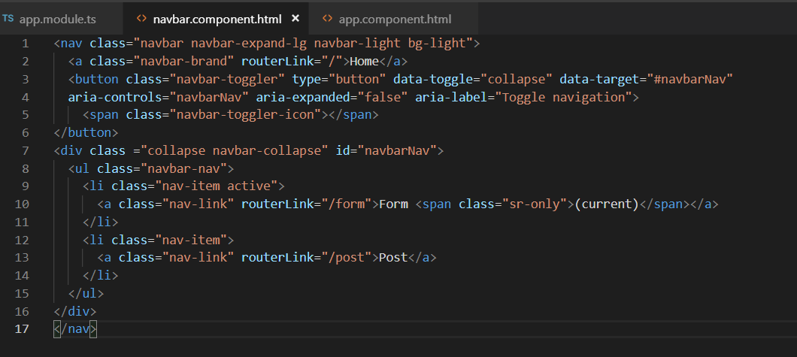

4. Jalankan, inspect element, coba link dan cek pada tab network. Catat dan beri penjelasan (Soal No. 8)
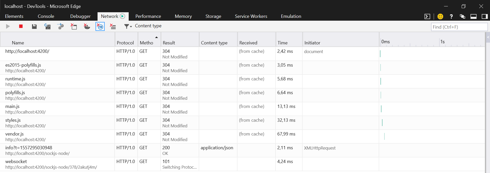

5. Modifikasi class li pada halaman navbar.component.html menjadi seperti pada gambar dibawah ini:
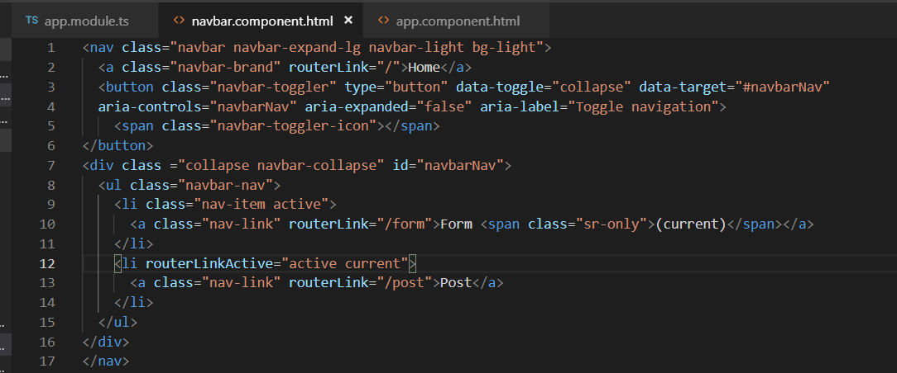

6. Jalankan, catat dan beri penjelasan (Soal No. 9)
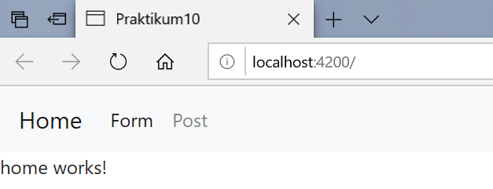

**Praktikum - Bagian 4 : Accesing Route Parameter**
1. Buat komponen baru dengan nama profile dengan perintah ng g c profile
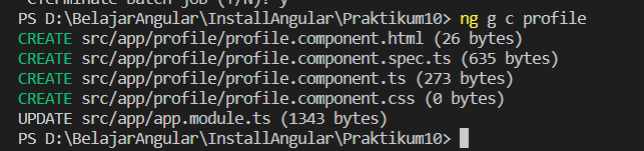

2. Buka app.module.ts dan tambahkan route untuk profile seperti gambar dibawah ini
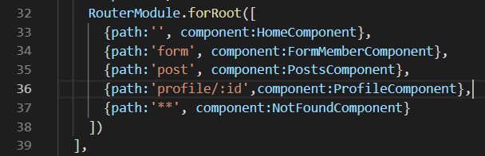

3. Modifikasi halaman home.component.html menjadi seperti gambar dibawah ini:
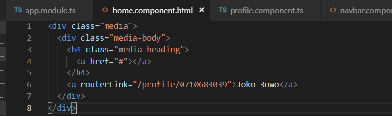

4. Modifikasi file profile.component.ts menjadi seperti pada gambar dibawah ini:
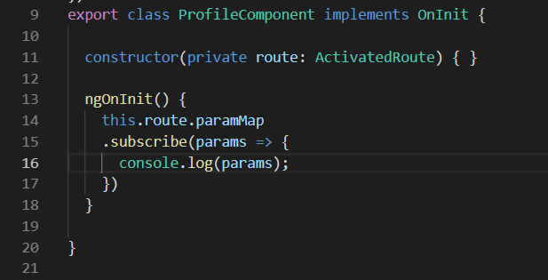

5. Jalankan, klik tombol home kemudian kliklink joko bowo kemudia inspect element seperti dibawah ini: Catat dan berikan penjelasan (Soal No. 10) Catat dan berikan penjelasan (Soal No. 10)
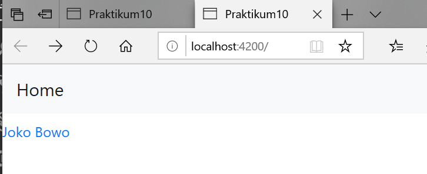
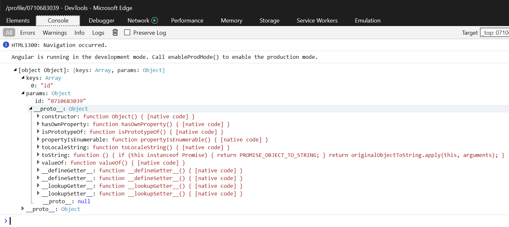

6. Modifikasi file profile.component.ts menjadi seperti pada gambar dibawah ini:
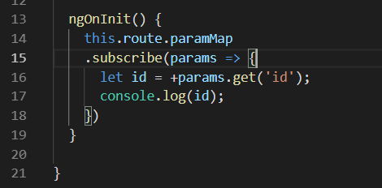

7. Jalankan, klik tombol home kemudian klik link joko bowo kemudia inspect element. Catat dan berikan penjelasan (Soaln No. 11)

  Yang ditampilkan adalah id saja. karena yang dipanggil pada souce code nya hanya id

