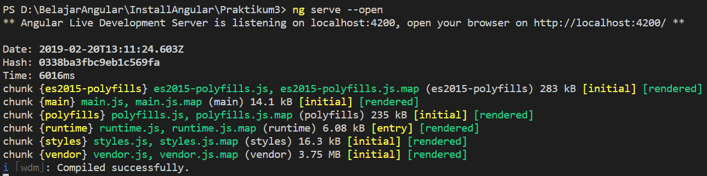
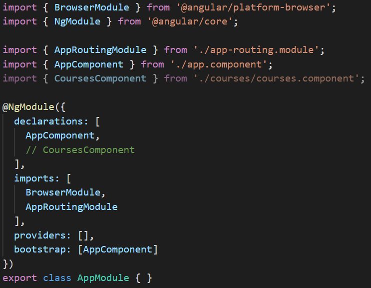
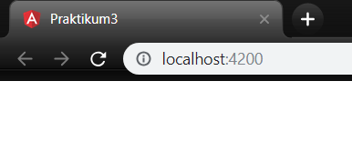
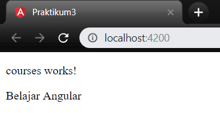
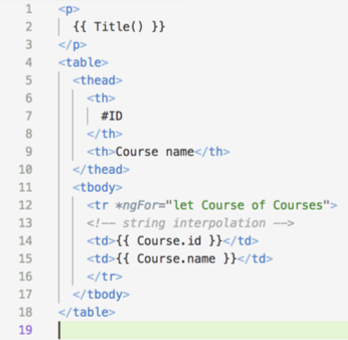
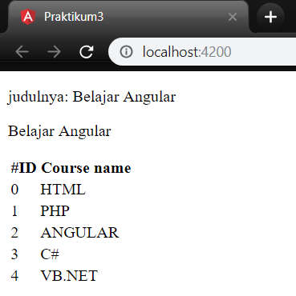

# Angular Fundamental Jobsheet 3

**Praktikum	–	Bagian	1:	Component	Basic**

* Buatlah	sebuah	componen	dengan	nama	courses

* Buka	file	app.component.html,	lakukan	modifikasi	code	nya	menjadi	seperti	berikut	:
```typescript
<app-courses></app-courses>
<router-outlet></router-outlet>
```
* Kemudian	open	terminal	dan	jalan	kan	perintah	ng	serve,	lalu	perhatikan	pada	browser.	Catat	hasilnya


* Buka	file	app.modules.ts	dan	hapus	coursecomponent	pada	declarations 

* Kemudian	lakukan	inspect	pada	halaman	localhost	:	4200	di	browser,	apa	yang	terlihat?	Berikan	penjelasan	(soal	4)


**Praktikum	–	Bagian	2:	Templates**
* Buka	file	courses.component.ts	tambahkan	property	baru	dengan	nama	title	
``` typescript
import{ Component, OnInit } from '@angular/core';
@component({
    selector: 'app-courses',
    templateUrl: './courses.component html',
    styleUrls: ['.courses.component.css']
})
export class CoursesComponent implements OnInit{
    title = "Belajar Angular";
    constructor() { }
    ngOnInit(){
    }
}
```
* Kemudian	buka	browser	localhost	:	4200.	Catat	hasilnya


* Tambahkan	string	pada	binding	datanya.	Buka	file	courses.component.html.	tambahkan	seperti	berikut	:
```typescript
<p>
    courses works!
</p>
<p>
    {{"judulnya:" + title}}
</p>
```
* Perhatikan	dan	catat	hasil	yang	ditampilkan	oleh	browser


* Buka	file	courses.component.ts	dan	buatlah	sebuah	method	dengan	nama	getTitle	seperti	berikut	ini	:	
```typescript
import{ Component, OnInit } from '@angular/core';
@component({
    selector: 'app-courses',
    templateUrl: './courses.component html',
    styleUrls: ['.courses.component.css']
})
export class CoursesComponent implements OnInit{
    title = "Belajar Angular";
    getTitle() {
        return this.title;
    }
    constructor() { }
    ngOnInit(){
    }
}
```
* Kemudian	buka	file	courses.component.html,	lakukan	modifikasi	sperti	berikut	:	


* Perhatikan	dan	catat	hasil	yang	ditampilkan	pada	browser


**Praktikum	-	Bagian	3:	Directive**
* Buka	file	courses.component.ts	dan	buat	property	dengan	nama	course	dengan	data	berupa	array
```typescript
import { Component, OnInit } from '@angular/core';
@component({
    selector: 'app-courses',
    templateUrl: './courses.component html',
    styleUrls: ['.courses.component.css']
})
export class CoursesComponent implements OnInit{
    title = "Belajar Angular";
    Courses = [
        {id :0, name: 'HTML'},
        {id :1, name: 'PHP'},
        {id :2, name: 'ANGULAR'},
        {id :3, name: 'C#'},
        {id :4, name: 'VB.NET'},
    ]
constructor() { }
    ngOnInit(){
    }
}
```
* Buka	file	courses.component.html	lalu	tambahkan	directive	ngFor	dan	string	interpolation	seperti	berikut


* Perhatikan	dan	catat	hasil	yang	ditampilkan	pada	browser	


**Praktikum	–	Bagian	4:	Services	dan	Dependency	Injection**
* Buatlah	service	baru	yang	bernama	courses	dengan	perintah		:	ng	generate	service	courses	atau	ng	g	s	courses	


* Buka	file	courses.service.ts	kemudian	tambahkan	method	getCourse	seperti	berikut	:	
```typescript
import { Injectable } from '@angular/core';
@Injectable ({
    providedIn: 'root'
})
export class CoursesService {
   constructor(){ }
    getCourses () {
        return[
        {id :0, name: 'HTML'},
        {id :1, name: 'PHP'},
        {id :2, name: 'ANGULAR'},
        {id :3, name: 'C#'},
        {id :4, name: 'VB.NET'},
    ];
    }
}  
 ```

 * Buka	file	courses.component.ts,	kemudikan	lakukan	modifikasi	codenya	seperti	berikut	:
 ```typescript
import { Component, OnInit } from '@angular/core';
@component({
    selector: 'app-courses',
    templateUrl: './courses.component html',
    styleUrls: ['.courses.component.css']
})
export class CoursesComponent implements OnInit{
    title = "Belajar Angular";
    Courses;
    constructor() { }
    ngOnInit() {
    }
}
```
* Perhatikan	dan	catat	hasil	yang	ditampilkan	pada	browser	(soal	10)	
 ```typescript
import { Component, OnInit } from '@angular/core';
import { CoursesServices } from '../courses.service';
@component({
    selector: 'app-courses',
    templateUrl: './courses.component html',
    styleUrls: ['.courses.component.css']
})
export class CoursesComponent implements OnInit{
    title = "Belajar Angular";
    Courses;
    constructor(private service:CoursesServices){
        this.Courses=service.getCourses();
    }
    ngOnInit() {
    }
}
```
