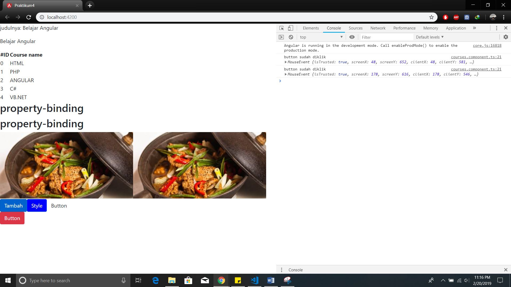
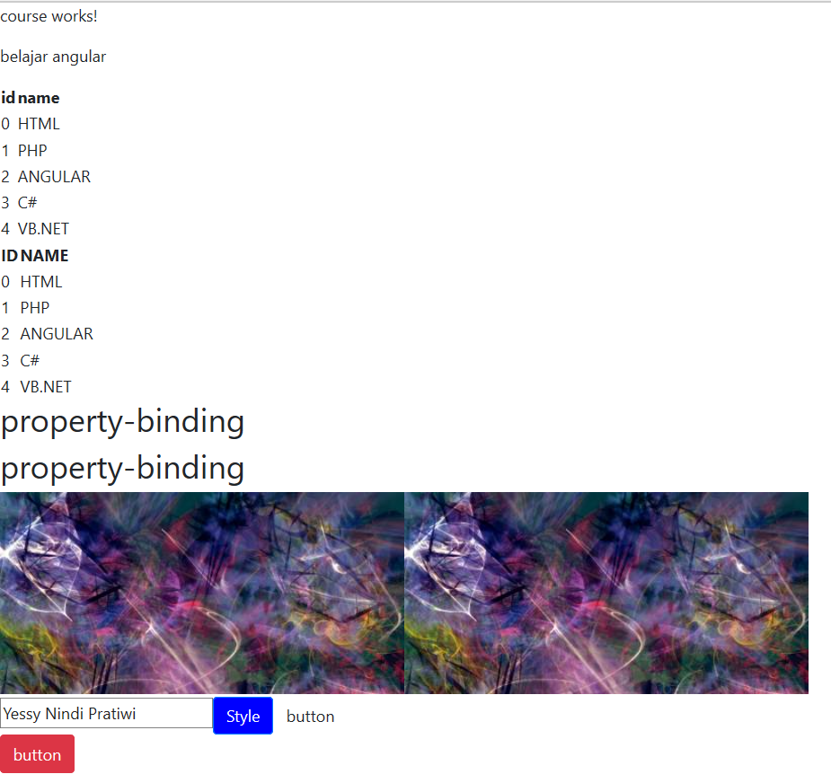

# Displaying Data and Handling Events

**Praktikum	–	Bagian	1:	Component	Basic**

* Buka file course.component.ts tambahkan code berikut ini :

```typescript
import { CoursesService } from './../courses.service';
import { Component, OnInit } from '@angular/core';
@Component({
  selector: 'app-courses',
  templateUrl: './courses.component.html',
  styleUrls: ['./courses.component.css']
})
export class CoursesComponent implements OnInit {
    title = 'Belajar Angular'
    Courses;
   binding = 'property-binding';
   imageUrl = 'http://lorempixel.com/400/200';
  constructor(private service:CoursesService) {
    this.Courses=service.getCourses();
   }
  ngOnInit() {
  }
}
  ```

* Buka file course.component.html tambahkan code berikut ini :

```typescript
<p>
  {{ Title }}
</p>
<table>
  <thead>
    <th>
    #ID
    </th>
     <th> Course Name </th>
  </thead>
  <tbody>
    <tr *ngFor="let Course of Courses">
      <td>{{ Course.id }}</td>
      <td>{{ Course.name }}</td>
    </tr>
  </tbody>
</table>
<h2>{{binding}}</h2>
<h2 [textContent] = 'binding'></h2>


}
```

*	Buka localhost lalu catat hasil nya (soal 1)


**Praktikum	–	Bagian	2:	Attribute Binding**
* Buka file courses.component.ts tambahkan property colspan dibawah line imageUrl.
```typescript
colSpan = 2;
```
* 2	Buka file courses.component.html dan tambahkan berikut ini :
 ```typescript
 <table>
  <tr>
    <td [colspan]='colspan'></td>
  </tr>
</table>
```

* Tambahkan attr pada colspan seperti berikut :
 ```typescript
 <table>
  <tr>
    <td [attr.colspan]='colspan'></td>
  </tr>
</table>
```
* Kemudian compile dan catat hasilnya (soal 2)
 

* Selanjutnya tambahkan button pada courses.component.html seperti berikut :
```typescript
<button type='button' class="btn-primary">tambah</button> 
```
* Perhatikan dan catat hasil yang ditampilkan pada browser (soal 3)


**Praktikum - Bagian 3: Class Binding**
* Buka file courses.component.ts dan tambahkan property isActive = true setelah line colspan = 2;
```typescript
isActive = true; 
```
* Buka file courses.component.html lalu tambahkan class binding seperti berikut 
```typescript
<app-root _nghost-c0 ng-version="7.2.3">
  <app-courses_ngcontent-c0-nghost-c1>
    <p _ngcontent-c1>
  </p>
<table _ngcontent-c1>..<table>
  <h2 _ng content-c1>property-binding</h2>
  <h2 _ng content-c1>property-binding</h2>
  
  
  <table _ngcontent-c1>..</table>
  <button __ngcontent-c1 class="btn btn-primary active" type="button">tambah</button>
</app-courses>
```

**Praktikum – Bagian 4: Style Binding**
* Buka file courses.component.html kemudian tambahkan code berikut :
```typescript
<button type="button" class="btn btn-primary" [style.backgroundColor]="isActive?'blue' : 'white'">Style</button>
```
* Catat hasilnya (soal 4)
 

**Praktikum – Bagian 5: Event Binding**
* Buka file course.component.ts dan buatlah method dengan nama onSave()
```typescript
isActive=false;
onSave(){
  console.log("button sudah diklik")
}
    constructor(private service:CoursesService) {
    this.Courses=service.getCourses();
    }
    ngOnInit(){
    }
```
* Buka file courses.component.html dan tambahkan event click
```typescript
<button type="button" class="btn btn-primary"
[style.backgroundColor]="isActive?'blue':white'">Style</button>
<button type = "button" class="btn btn-default" (click)="onSave()">button</button>
```

* Jalankan localhost:4200 dan lakukan inspect element. Jika button di click maka pada console akan muncul keterangan button sudah di klik


* Buka file courses.component.ts tambahkan parameter $event
```typescript
isActive=false;
onSave($event){
  console.log("button sudah diklik",$event)
}
```
* Tambahkan juga pada courses.component.html
```typescript
<button type="button" class="btn btn-primary"
[style.backgroundColor]="isActive?'blue':white'">Style</button>
<br></br>
<button type = "button" class="btn btn-danger" (click)="onSave()">button</button>
```
* Jalankan localhost dan inspect element, catat hasilnya (soal 5)


* Buatlah method onDivClick() pada courses.component.ts
```typescript
  onSave($event){
  console.log("button sudah diklik",$event)
  }
  onDivClick($event){
     console.log("ini method div",$event)
  }
```

* Tambahkan div dan event binding pada div elemen
  ```typescript
  <div (click) = "onDivClick($event)">
    <button type="button" class="btn btn-danger"
    (click)="onSave($event)">button</button>
    </div>
    ```
* Jalankan localhost dan lakukan inspect elemen. Apa yang terjadi ? catat hasilnya dan jelaskan (soal 6)


* Untuk mengatasi event bubbling maka tambahkan $event.stopPropagation pada courses.component.ts
```typescript
isActive=false;
onSave($event){
  $event.stopPropagation();
  console.log("button sudah diklik",$event)
}
onDivClick($event){
     console.log("ini method div",$event)
  }
```

* Jalankan localhost dan lakukan inspect elemen. Lihat pada console apa yang terjadi? Catat hasilnya dan jelaskan. (soal 7)


**Praktikum – Bagian 6: Event Filtering**

* Buat inputan pada courses.component.html
```typescript
<input type="text"(keyup.enter)="onKeyUp()">
```
* Tambahkan method onKeyUp
```typescript
onSave($event){
  $event.stopPropagation();
  console.log("button sudah diklik",$event)
}
onDivClick($event){
     console.log("ini method div",$event)
  }
  onKeyUp(){
     console.log("enter was pressed");
  }
```
* Jalankan localhost, kemudian isikan sesuatu pada kolom inputan yang sudah dibuat dan lakukan inspect elemen. Perhatikan pada console, Catat apa yang terjadi. (soal 8)


**Praktikum – Bagian 7: Template Variable**
* Tambahkan variabel #nama pada courses.component.html
```typescript
<input  type="text" #nama(keyup.enter)="onKeyUp(nama.value)">
```

* Tambahkan parameter nama pada method onKeyUp
```typescript
onKeyUp(nama){
  console.log(nama);
}
```

**Praktikum – Bagian 8: Two Way Binding**
* 1	Buat property baru dengan nama kalian masing-masing dan rubah parameter pada log
 ```typescript
 nama ='Yessy Nindi Pratiwi TI-2B'
 onSave($event){
  $event.stopPropagation();
  console.log("button sudah diklik",$event)
}
onDivClick($event){
     console.log("ini method div",$event)
  }
  onKeyUp(){
     console.log(this.nama);
  }
```

* Tambahkan parameter nama pada method onKeyUp
```typescript
<input type="text" [value]='nama'(keyup.enter)="nama = $event.target.value;onKeyUp()">
```

* Buka app.module.ts dan tambahkan formmodule seperti berikut :
```typescript
import { FormsModule } from '@angular/forms';
import { AppRoutingModule } from './app-routing.module';
import { AppComponent } from './app.component';
import { CourseComponent } from './course/course.component';
import { CoursesComponent } from './courses/courses.component';
@NgModule({
  declarations: [
    AppComponent,
    CourseComponent,
    CoursesComponent,
  ],
  imports: [
    BrowserModule,
    AppRoutingModule,
    FormsModule
  ],
  providers: [CoursesService],
  bootstrap: [AppComponent]
})
export class AppModule { }
```

* Buka course.component.html, modifikasi code nya seperti berikut :
 ```typescript
 <br></br>
 <!--
 <input type="text" [value] = "nama"
 (keyup.enter)="nama = $event.target.value;onKeyUp()"> -->
 <input type="text" [(ngModel)] = "nama"
 (keyup.enter)="onKeyUp()">
 ```
 * Perhatikan apa yang terjadi pada kolom inputan? Cek pada inspect element dan lihat di console. Catat dan jelaskan. (soal 12)
 