# Directive

**1. NgIF**

1. Buka file :

  

2. Buka file:

  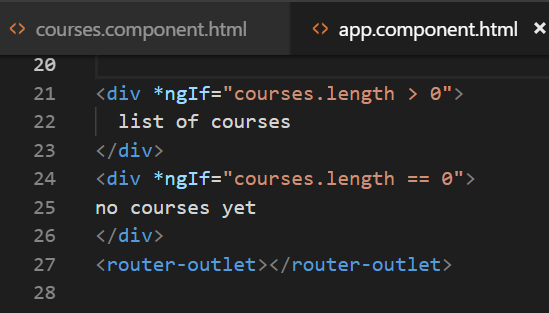

3. Jalankan locallhost maka hasilnya seperti berikut :

4. Jika array pada app.component.ts (courses=[];) dikosongkan maka hasilnya seperti berikut :
 
 
*contoh kedua  menggunakan else:*
5. buka file app.component.html modifikasi kodenya menjadi berikut  
 

6. jalankan localhost dengan kondisi array pada app.component 
dengan array kosong

* dengan array ada isi

*Cara ketiga*

7.  Buka file app.component.html modifikasi kodenya menjadi berikut

8. jalankan localhost dengan kondisi array pada app.component
dengan array kosong

* dengan array ada isi

**Hidden Property**

1. buka app.component.html :

2. jalankan localhost maka hasilnya seperti berikut : 

3. selain contoh diatas kita juga dapat memberikan property seperti berikut:

4. jalankan localhost (berbeda hasil jika pada array courses tidak terdapat isinya)
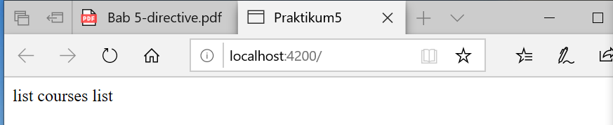

5. Jika kita inspect element maka akan terlihat property hidden tidak terdapat kondisi true ataupun false.

6. berbeda jika kita menggunakan ngIF terdapat bindings dengan nilai false 

**ngSwitchCase**

1. buka file app.component.html modifikasi codenya menjadi seperti berikut 

2. buka file app.component.ts tambahkan property viewMode (line 12) 

3. run localhost maka hasilnya seperti berikut saat diklik list view maka akan muncul list view content dan jika kita pilih ListView maka akan tampil tulisan List View Content 
 
 
**NgFor**

4. buka app.component.ts property CoursesFor yang berisikan array (line 12) 
 

5. buka file app.component.html tambahkan directive ngFor pada element li
 

6. jika dijalankan maka hasilnya seperti berikut
 

7. kita juga dapat memberi tanda tertentu pada index yang bernilai ganjil dengan menggunakan isEven https://angular.io/api/common/NgForOf  
  

  

**6.1 ngFor dan change Detection**
1. tambahkan button pada app.component.html (line 64) 
 

2. tambahkan method onAdd()
  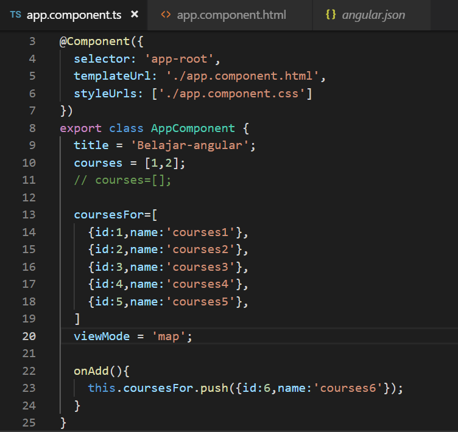

3. sehingga hasilnya seperti berikut (jika kita tekan button add maka akan ditambahkan sebuah data courses 6) 
    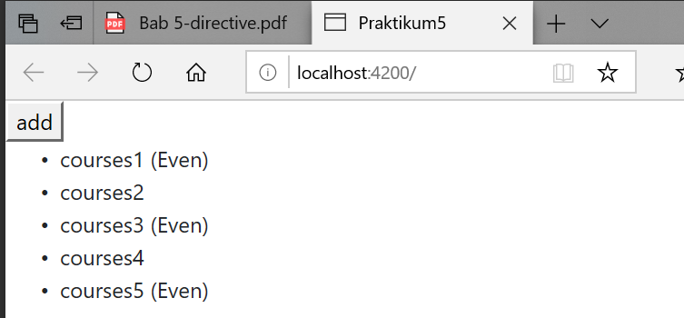
    

4. Tambahkan sebuah method onRemove pada app.component.ts 
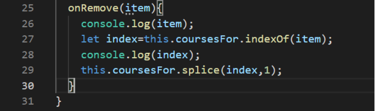

5. Buka app.component.html dan tambahkan sebuah button untuk menghapus (line69)

6. hasilnya seperti berikut (pada saat button remove diclick maka salah satu data akan hilang sementara)

7. buka file app.component.html tambahkan button (line 70) 
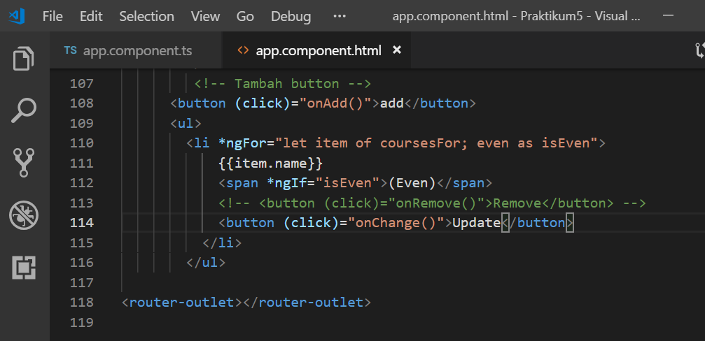

8. buka file app.component.ts buatlah sebuah method onChange dengan parameter item dan didalam method tersebut adanya perubahan string menjadi updated 
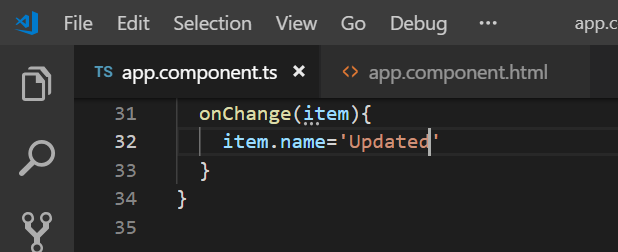

9. hasilnya 

**ngFor dan trackby**

1. Buka file app.component.ts buatlah sebuah method dengan nama loadCourses (line 38) tapi sebelumnya buat sebuah property dengan nama coursesForOne (line 37) 
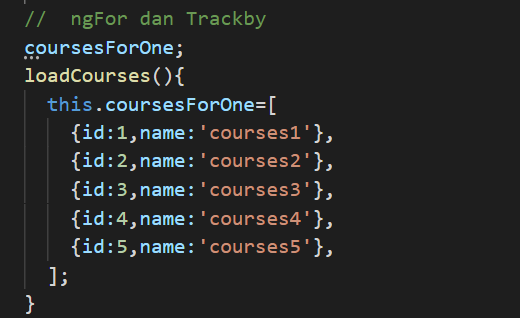

2. buka file app.component.html dan tambahkan code seperti pada gambar

3. hasilnya saat button diclick

4. sekarang kita lakukan analisa buka inspect element, saat button belum diclick seperti pada gambar berikut 

5. dan saat button diklik maka element ul akan muncul seperti pada gambar berikut :
 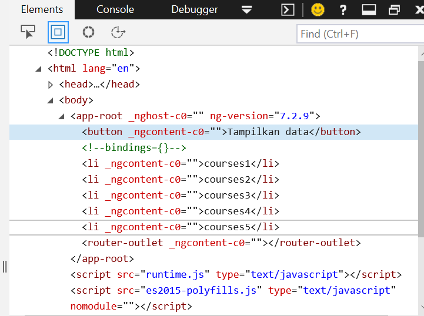

6. untuk menambahkan TrackBy dengan cara menambahkan pada app.component.html pada directive ngFor 

7. selain itu tambahkan juga sebuah method trackCourse dengan parameter index dan itemone pada app.component.ts
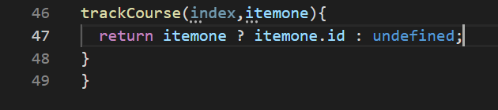

**6.1 The leading Asterik**

**6.1 ngClass**

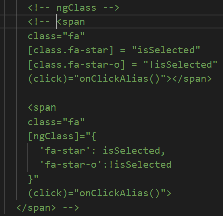

**6.1 Custom Directive**
1. pertama kita harus membuat directive dengan nama input-format terlebih dahulu dengan perintah seperti berikut
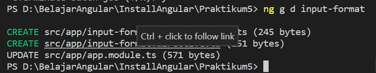

2. jika directive berhasil digenerate maka kita pastikan di app.module.ts pada @NgModule terdapat nama directive yang kita buat tadi 
 
 
3. buka input-format.directive.ts dan tambahkan decorator HostListener seperti pada gambar berikut
  

4. Buka file app.component.html dan tambahakn code berikut
  

5. buka file input-format.directive.ts dan modifikasi codenya menjadi berikut 
 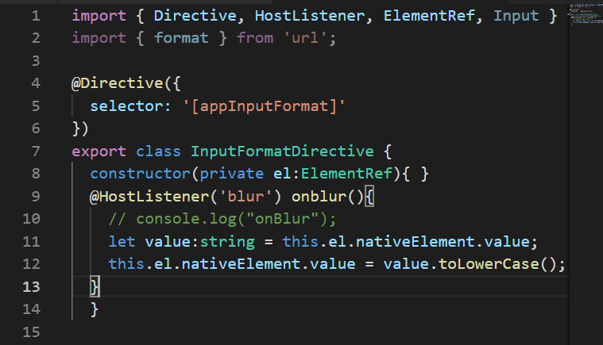

6. buka file app.component.html dan tambahkan property binding dengan nama format 
  

7. buka file input-format.directive.ts tambahkan decorator input dan modifikasi codenya seperti pada gambar berikut
    

8. cat:format disini adalah kondisi di app.component.html 
    

9. buka app.component.hml modifikasi codenya menjadi berikut
 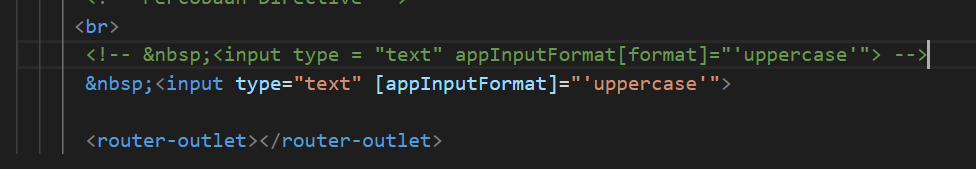

10. buka input-format.directive.ts dan tambahkan decorator input dengan parameter appInputFormat 
  

11. HASIL

    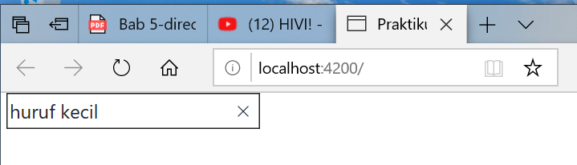
    
    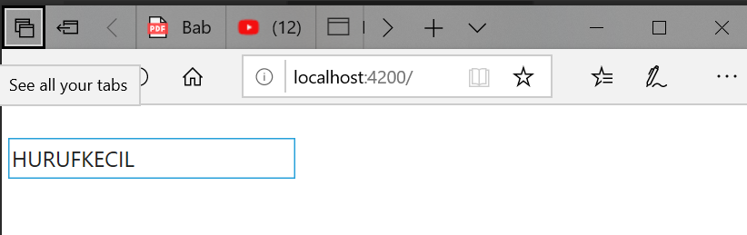
