#Jobsheet-6: Directives

**Praktikum – Bagian 1: Building a Bootstrap Form**

1. Buat component baru dengan nama signup-form dengan perintah ng g c signup-form
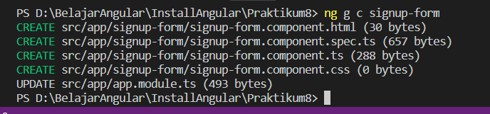

2. Modifikasi app.component.html menjadi seperti berikut:
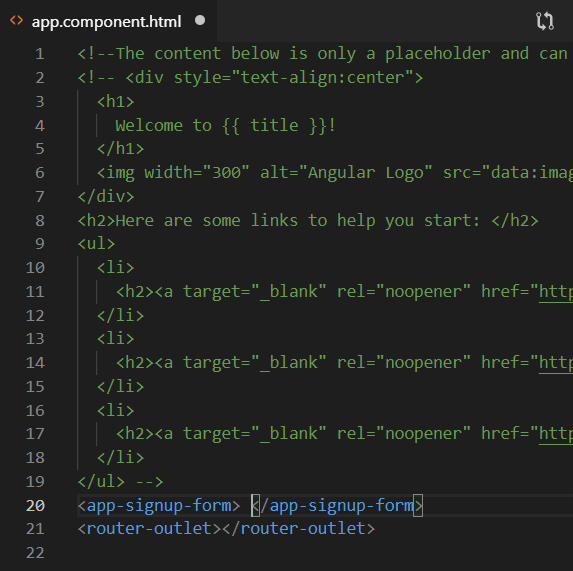

3. Modifikasi file signup-form.component.html menjadi seperti berikut:
 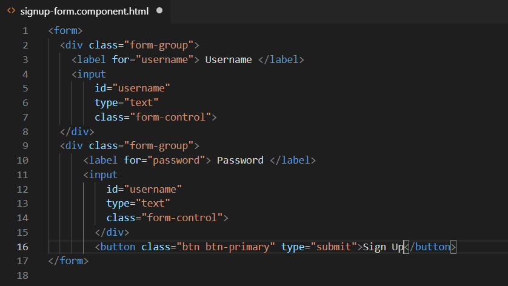

4. Jalankan dan Catat hasilnya (soal 1)
 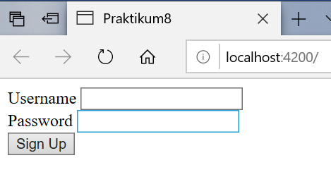

 **Praktikum – Bagian 2: Control Programmatically**

 1. Modifikasi file signup-form.component.ts seperti dibawah ini:
 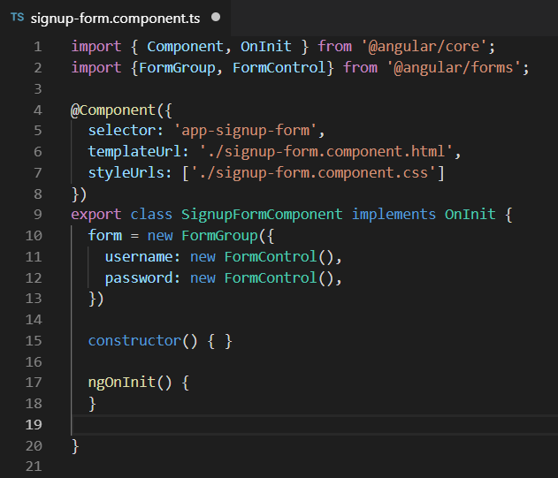

2. Modifikasi signup-form.component.html menjadi seperti berikut:
  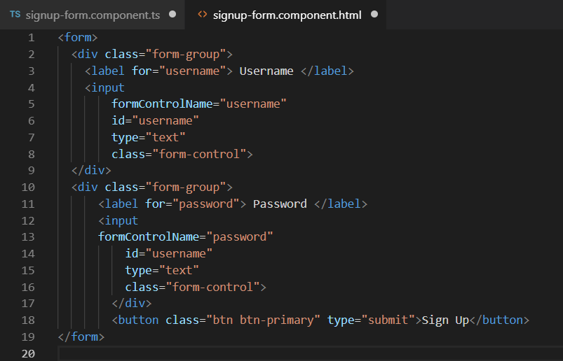

3. Jalankan dan Catat hasil inspect elemen pada bagian console (soal 2), Akan muncul eror seperti berikut:
  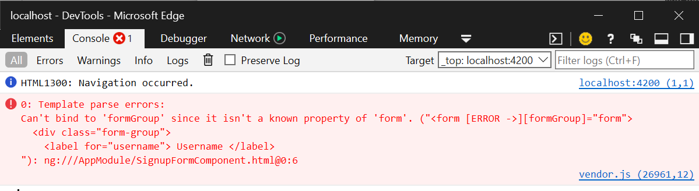

4. Modifikasi file app.module.ts tambahkan kode berikut:
  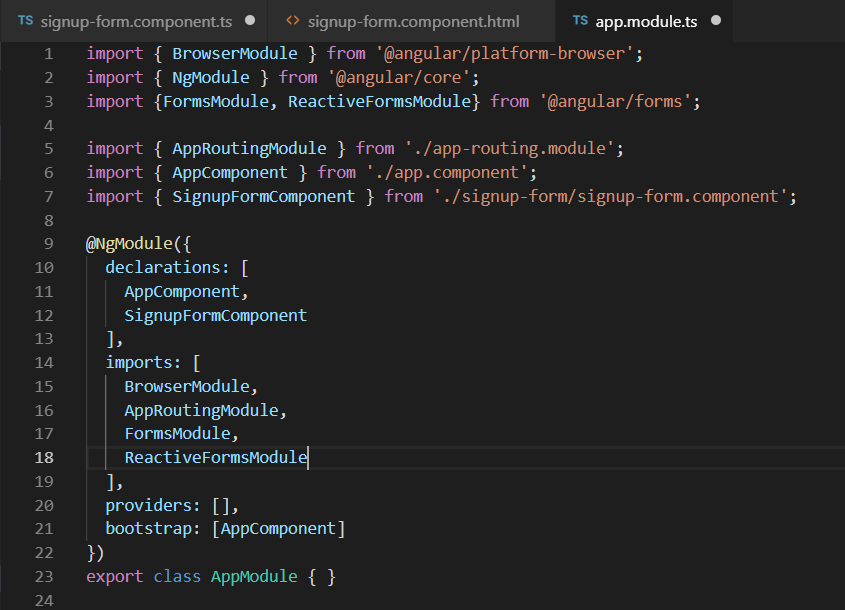

5. Jalankan dan Catat hasilnya di bagian console pada browser (soal 3)
  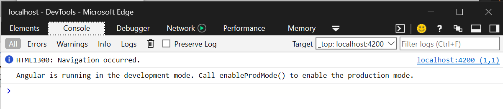

**Praktikum - Bagian 3: Adding Validation**
1. Modifikasi signup-form.component.ts menjadi seperti berikut:
  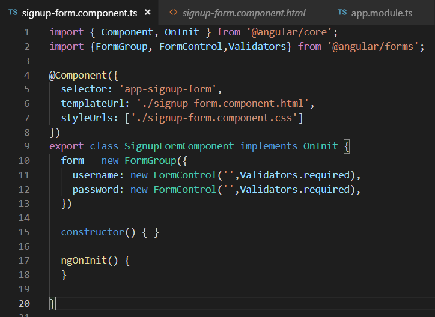

2. Modifikasi signup-form.component.html menjadi seperti berikut:
  

3. Jalankan, apakah validasi formnya berfungsi dan Catat hasilnya (soal 4)
  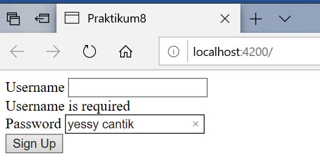

4. Tambahkan get username pada file signup-form.component.ts seperti berikut:
  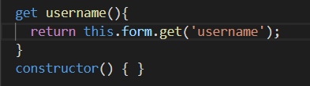

5. Modifikasi file signup-form.component.html menjadi seperti berikut:
   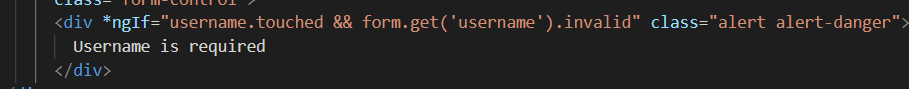

6. Jalankan dan Catat hasilnya (soal 5)
    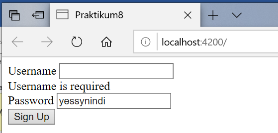

**Praktikum - Bagian 4: Specific Validation Errors**

1. Modifikasi signup-form.component.ts menjadi seperti berikut:
    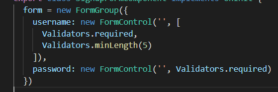

2. Modifikasi signup-form.component.html menjadi seperti berikut:
    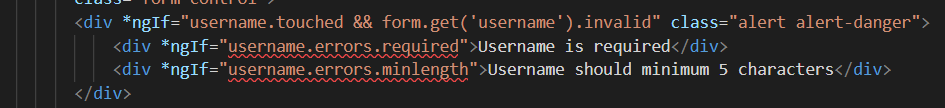

3. Jalankan dan Catat hasilnya (soal 6)
    

4. Modifikasi signup-form.component.html menjadi seperti berikut:
    

5. jalankan dan Catat hasilnya (soal 7)
    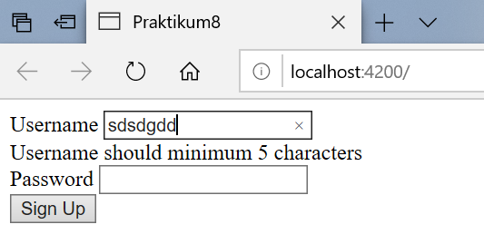

**Praktikum - Bagian 5: Custome Validation**

1. Buat file baru pada folder signup-form dengan nama username.validators.ts dan isi dengan script sebagai berikut:
    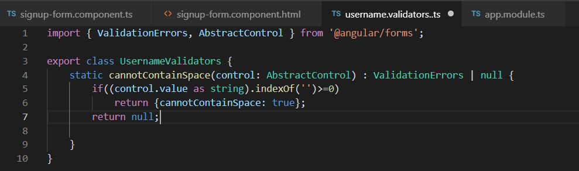

2. Modifikasi signup-form.component.ts menjadi seperti berikut:
    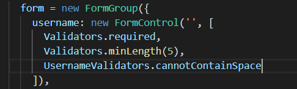

3. Modifikasi signup-form.component.html menjadi seperti berikut:
    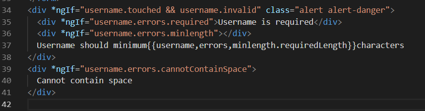

4. Jalankan dan Catat hasilnya (soal 8)
    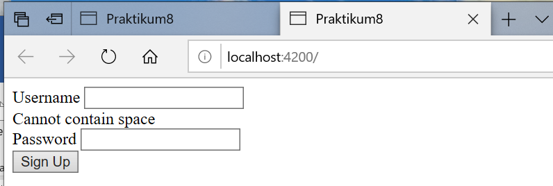

**Praktikum - Bagian 6: Asyncronus Validation**

1. Modifikas file username.validators.ts seperti berikut:
   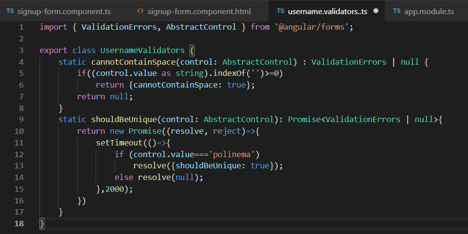

2. Modifikasi signup-form.component.ts menjadi seperti berikut:
    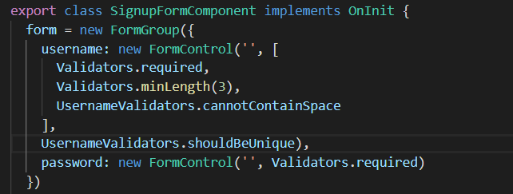

3. Modifikasi signup-form.component.html, tambahkan 
 seperti berikut:
     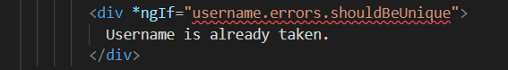

4. Jalankan dan Catat hasilnya (soal 9)
    

**Praktikum - Bagian 7: Displaying a Loader Image**
1. Modifikasi signup-form.component.html, tambahkan 
 seperti berikut:
 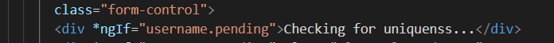

2. Jalankan dan Catat hasilnya (soal 10)
 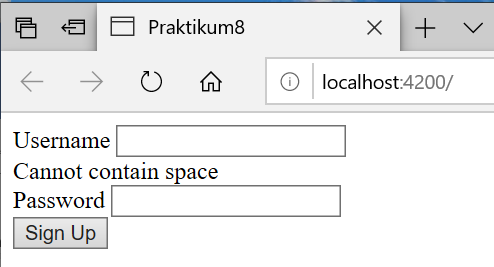

 **Praktikum - Bagian 8: Validating Form on Submit**

 1. Modifikasi signup-form.component.ts, dengan menambahkan method login() seperti berikut:
  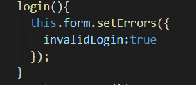

 2. Modifikasi signup-form.component.html seperti berikut
   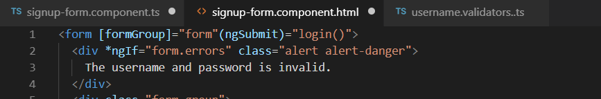

 3. Jalankan dan Catat hasilnya (soal 11)
    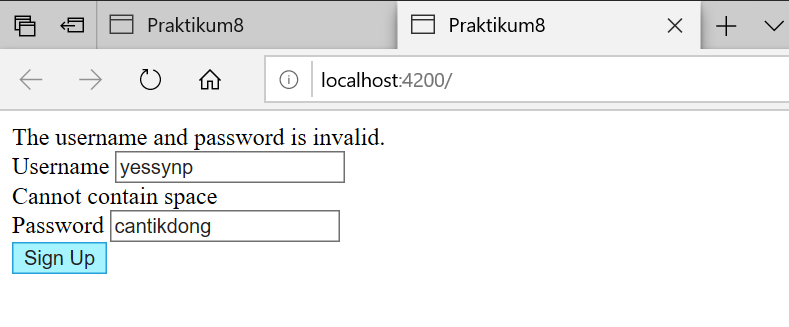
