# HTTP Service

**Praktikum – Bagian 1: JSONPlaceHolder**

- Pada bagian ini kita akan menggunakan fake HTTP Service yang akan kita gunakan sebagai back end aplikasi kita. Kunjungi alamat berikut : http://jsonplaceholder.typicode.com/
Jika Anda scroll down maka Anda akan menemukan bagian Resources seperti pada gambar 2 berikut 
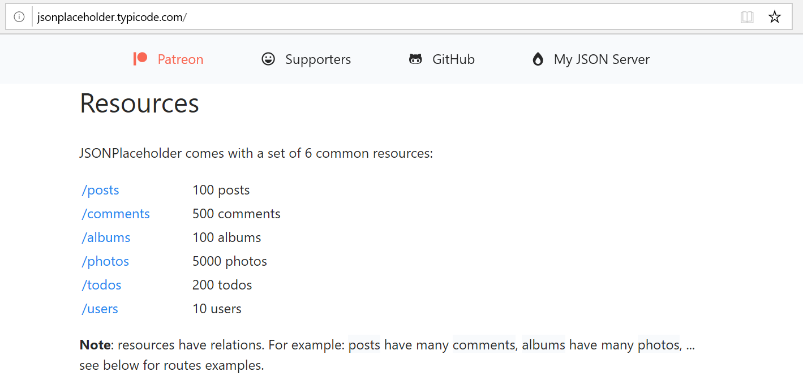

**Praktikum - Bagian 2 : Getting Data**
1. Buat component baru dengan nama posts dengan perintah ng g c posts
 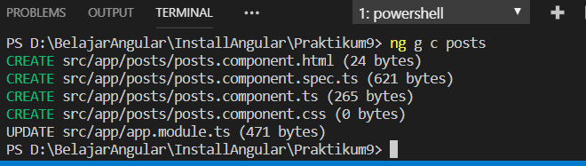

2. Untuk menggunakan HTTPService, kita perlu melakukan import HttpModule pada app.module.ts.
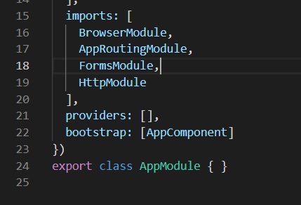

3. Jika HttpModule tidak muncul secara otomatis maka anda harus menginstal terlebih dahulu dengan perintah npm i @angular/http
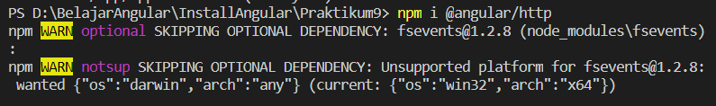

4. Modifikasi file posts.component.ts menjadi seperti berikut
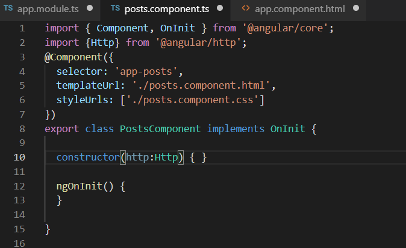

5. Ubah file app.component.html seperti berikut :
 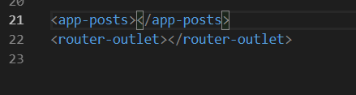

6. Jalankan dan Catat hasilnya (soal 1)
 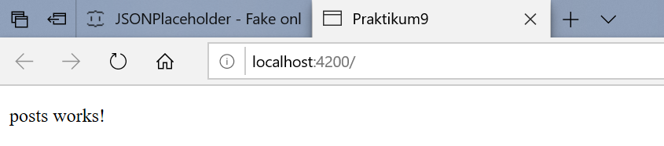

7. Bagaimana jika anda lupa melakukan import HttpModule pada langkah ke-2 ? Lakukan commenting pada HttpModule seperti pada kode berikut :
 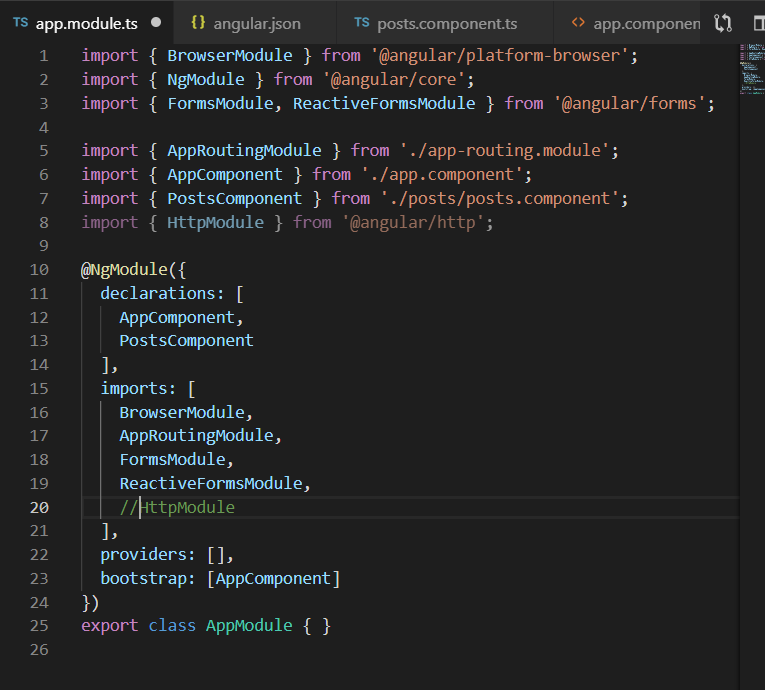

8. Apa yang terjadi pada console? Berikan penjelasan atas error yang terjadi. (soal 2)
 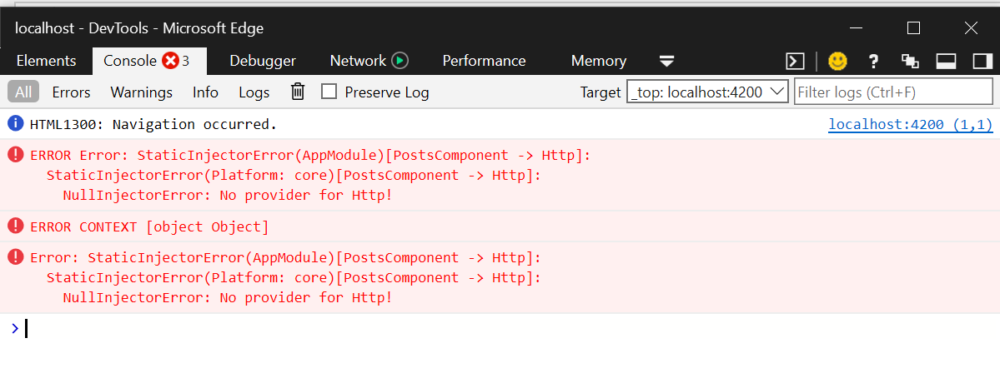

9. Lengkapi kode program pada posts.component.ts menjadi :
  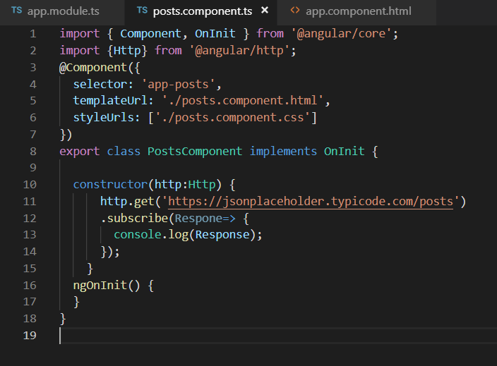

10.  Jalankan pada browser dan jelaskan yang muncul pada console. (soal 3)
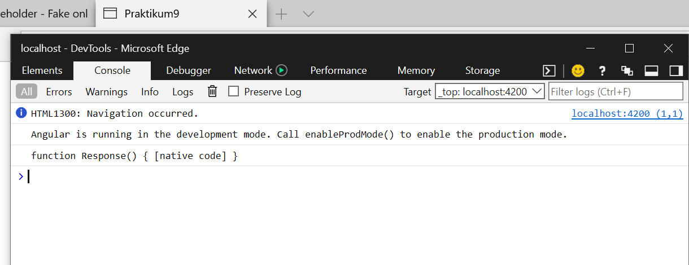

11. Jelaskan perbedaan yang terjadi pada console jika kode pada posts.component.ts diubah menjadi : (soal 4)
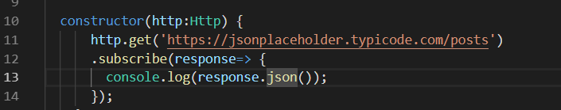

12. Untuk menampilkan data pada halaman browser, ubah kode program pada posts.component.html seperti berikut :
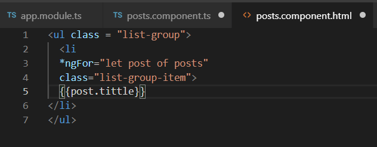

13. Ubah kode program pada posts.component.ts :
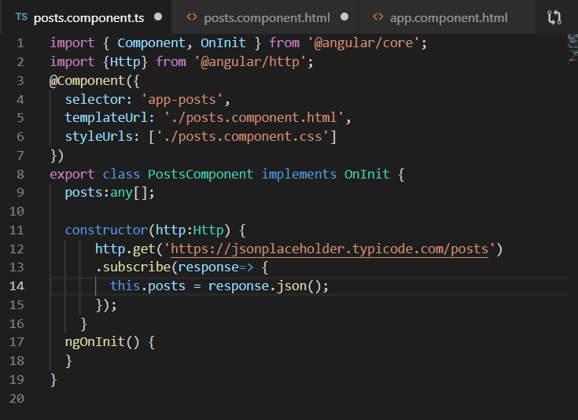

14. Jalankan dan jelaskan apa yang muncul pada browser. (soal 5)
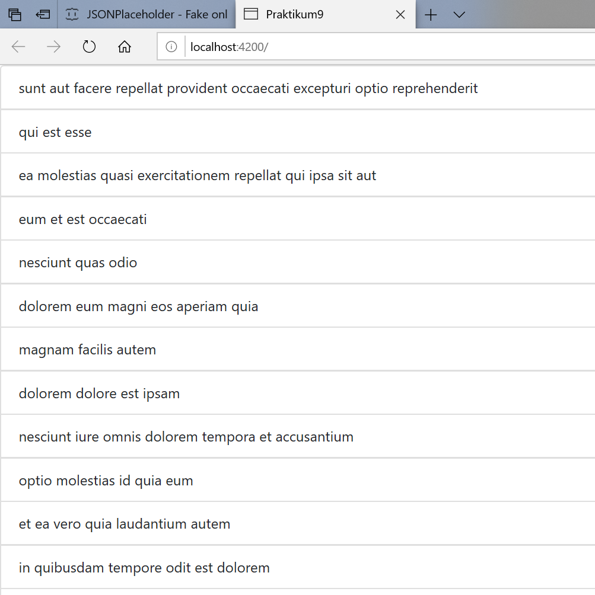

**Praktikum - Bagian 3 : Creating Data**

1. Kita akan menambahkan sebuah text area untuk memasukkan data melalui browser, seperti gambar berikut :
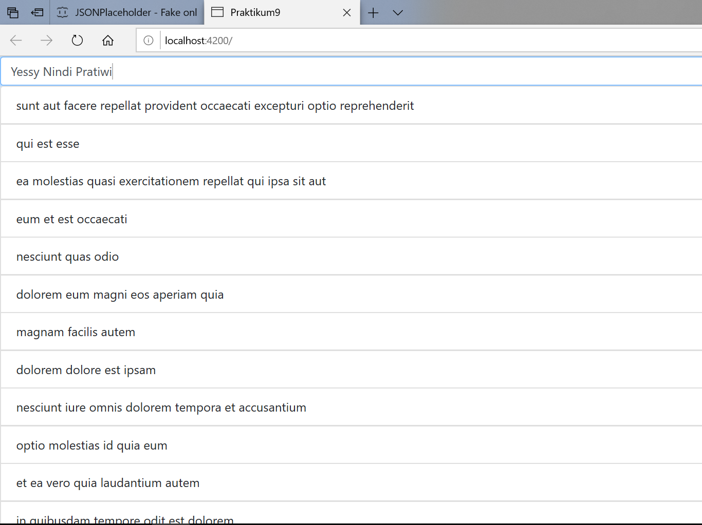

2. Pertama, tambahkan input elemen pada posts.component.html :
 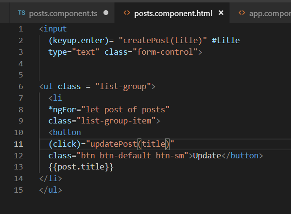

3. Modifikasi kode program pada posts.component.ts 
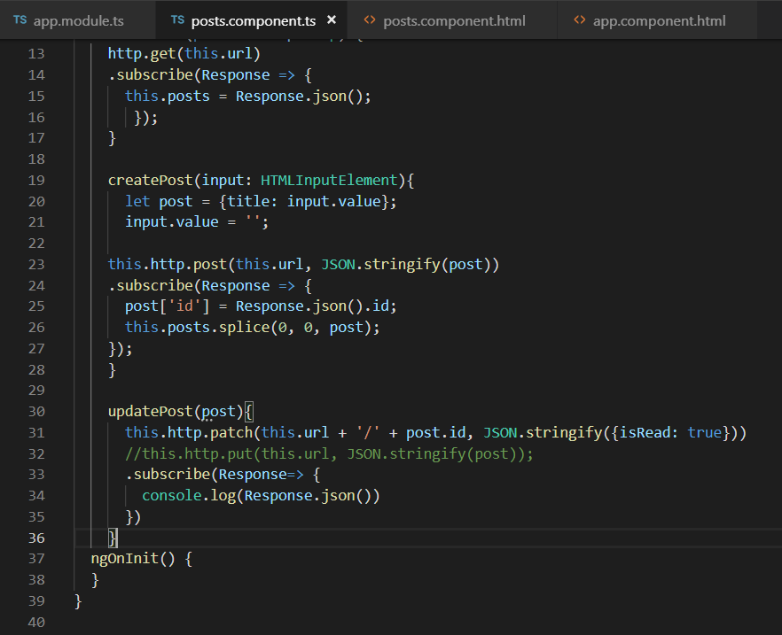

4. Simpan dan jalankan pada browser.
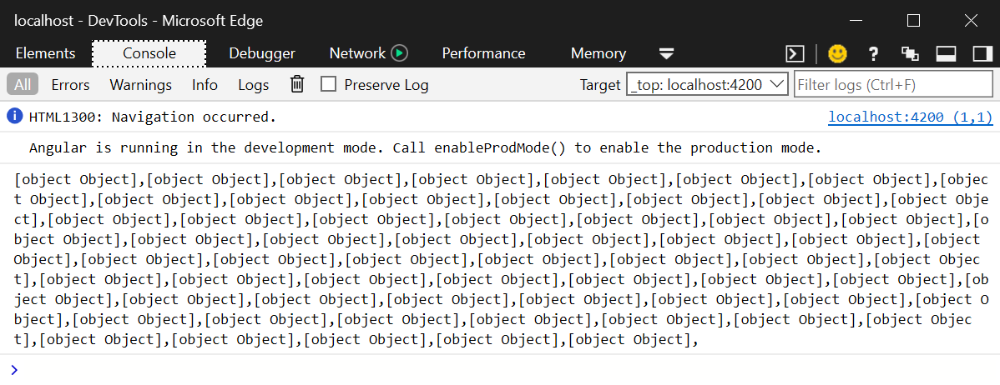

5. Jelaskan dengan kalimatmu sendiri bagaimana jalannya program setiap baris pada fungsi createPost. (soal 6)
  Hasil Keluaran Berupa ID

**Praktikum - Bagian 4 : Updating Data**

1. Kita akan menambahkan sebuah button Update untuk mengubah data melalui browser, seperti gambar berikut :
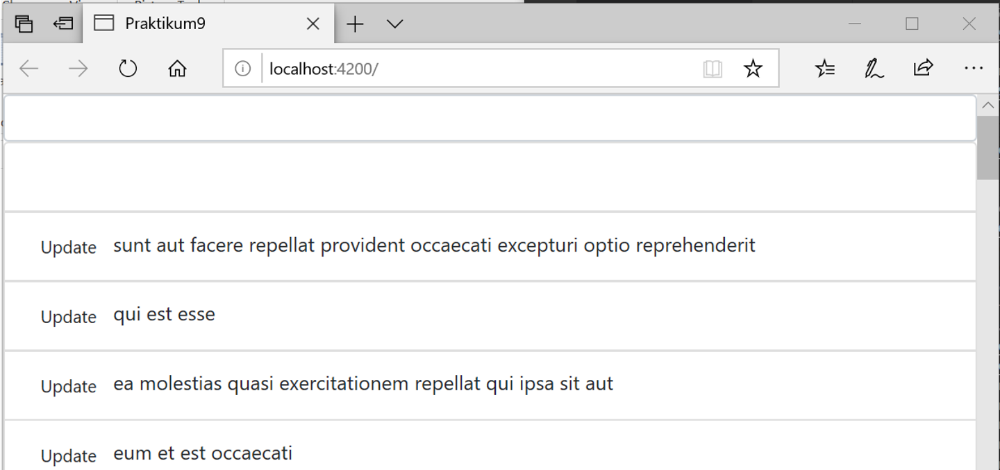

2. Tambahkan button Update dengan modifikasi kode program seperti di bawah ini :

3. Tambahkan fungsi updatePost pada posts.ts seperti di bawah :

4. Simpan dan jalankan pada browser
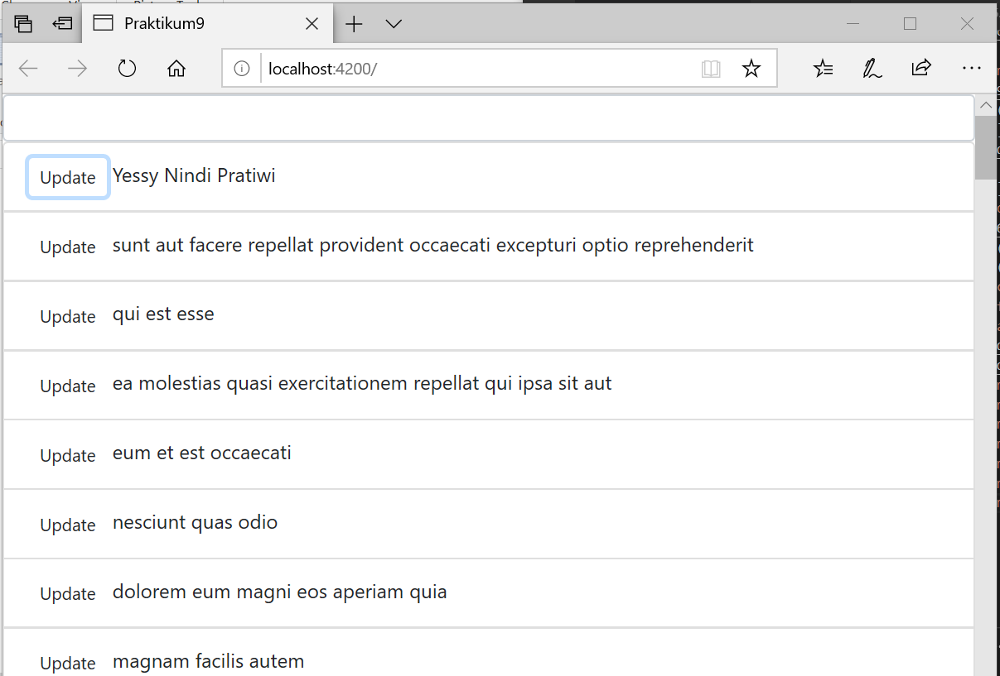

5. Apa fungsi patch pada potongan kode program pada langkah 3? (soal 7)
  Untuk memodifikasi isi dari UpdatePost

**Praktikum - Bagian 5 : Deleting Data**
1. Kita akan menambahkan sebuah button Delete di sebelah button Update untuk menghapus data melalui browser, seperti gambar berikut:

2. Tambahkan button Delete dengan modifikasi kode program seperti di bawah ini :
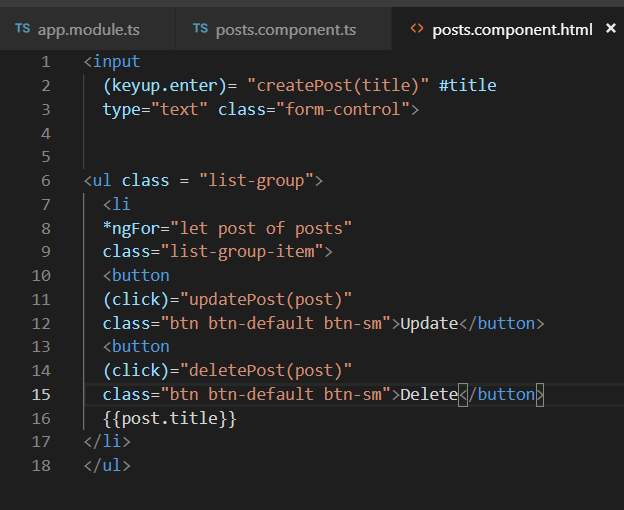

3. Tambahkan fungsi deletePost pada posts.ts seperti di bawah :
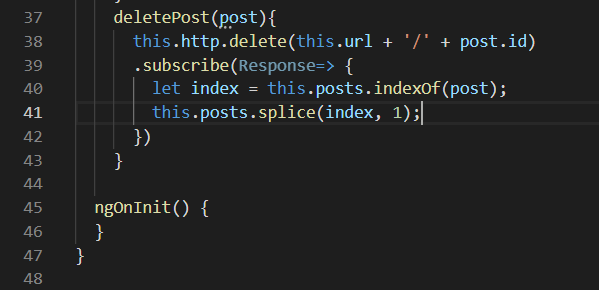

4. Simpan dan jalankan pada browser.
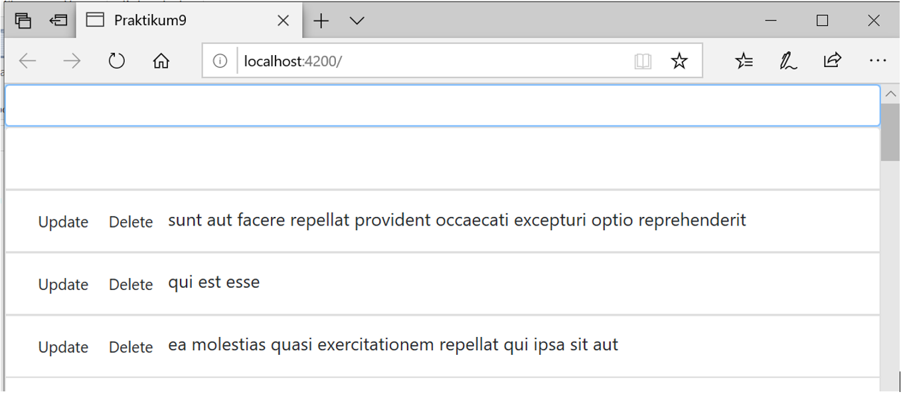

5. Apa fungsi splice pada potongan kode program pada langkah 3? (soal 8)
  Menambah dan Menghapus elemen baru 
